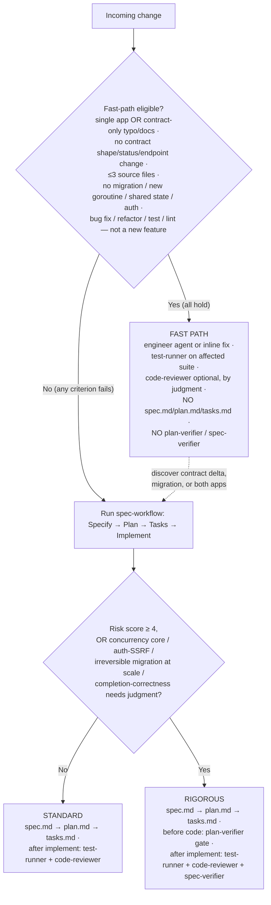

# `.claude` — how work is routed

This directory holds the agents, skills, and conventions that drive development in this repo. The first decision on any change is **how much ceremony it needs**: the fast path (no spec artifacts), the Standard tier, or the Rigorous tier. The deterministic floor — `make check` (or the affected `make test-*`), contract sync, and `-race` — runs at **every** level; the routing below only governs how much spec ceremony and LLM verification sits on top.

## Decision tree

In prose:

1. **Is the change fast-path eligible?** All of: single app (or contract-only typo/docs); no contract shape/status/endpoint change; ≤ 3 source files; no migration, new shared state, or auth surface; and the intent is a fix/refactor/cleanup — not a new feature slice. (The `spec-workflow` skill holds the exact thresholds — this is the summary.)
   - **Yes** → fast path: engineer agent (or inline fix) → `test-runner` on the affected suite → `code-reviewer` only if it touches handlers, concurrency, or API-client usage. No spec artifacts, no verifier subagents. If mid-work you hit a contract delta, migration, or both apps, **stop and escalate** to the full workflow.
   - **No** → run the `spec-workflow` skill (Specify → Plan → Tasks → Implement) and pick a tier.

2. **Standard vs Rigorous** (computed at Specify from the risk rubric, re-checked at Plan):
   - Score **0–3** → **Standard**: the three spec artifacts; after implement, `test-runner` + `code-reviewer`.
   - Score **≥ 4**, or any of {concurrency core, auth/SSRF, irreversible migration at scale, completion-correctness needing judgment} → **Rigorous**: same artifacts; `plan-verifier` gate before code; `test-runner` + `code-reviewer` + `spec-verifier` after implement.

A manual tier set without the `(auto)` marker always wins, and tiers only ever ratchet **up** at Plan, never down. See `.claude/skills/spec-workflow/SKILL.md` for the full rubric and procedures.
